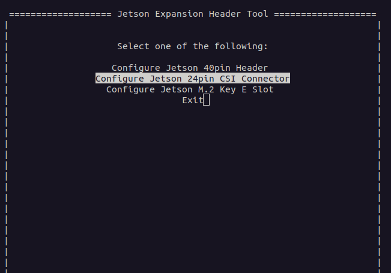
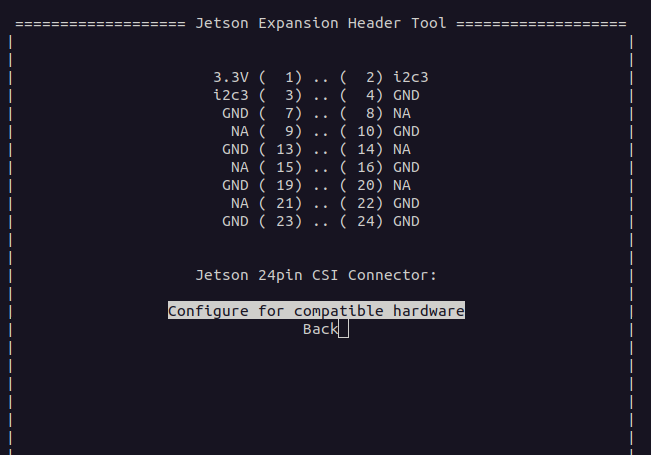
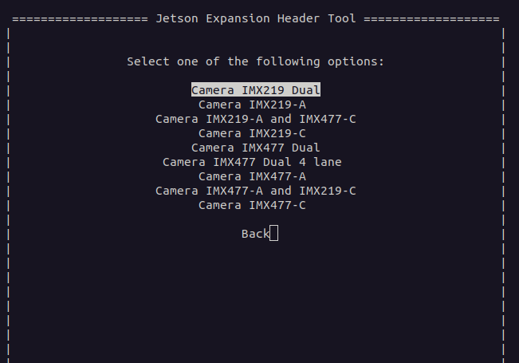
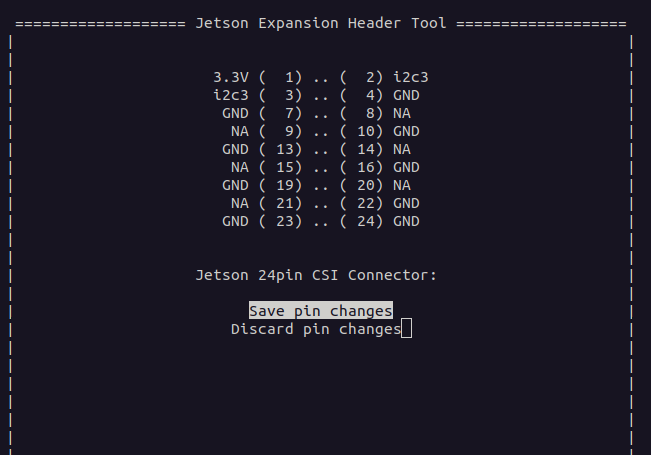
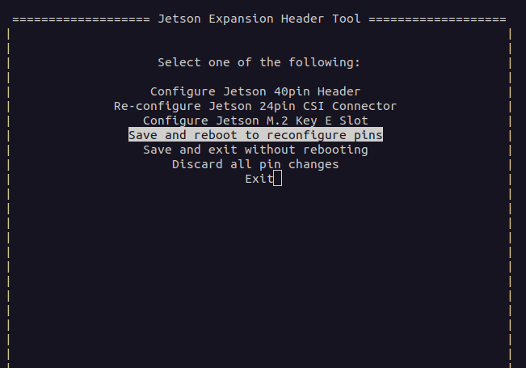

# Jetson Orin Nano Camera Configuration

This guide explains how to configure and test CSI cameras (IMX219, IMX477, etc.) on the NVIDIA Jetson Orin Nano using the **Jetson Expansion Header Tool (jetson-io)**.

---

## 📌 Prerequisites
- Jetson Orin Nano with JetPack installed
- Camera module (IMX219 / IMX477 or compatible CSI camera)
- Access to terminal

---

## ⚙️ Launch Jetson-IO Tool
Navigate to the Jetson-IO directory and run:

```bash
cd /opt/nvidia/jetson-io
sudo python jetson-io.py
```


## Re-configure CSI Connector
Select Re-configure Jetson 24pin CSI Connector:



## Select Camera Module
Choose your camera module (e.g., IMX219 Dual, IMX477 Dual):



## Save Pin Changes
After reviewing, choose Save Pin Changes:



## Save and Reboot
Confirm by selecting Save and Reboot so the configuration takes effect:




